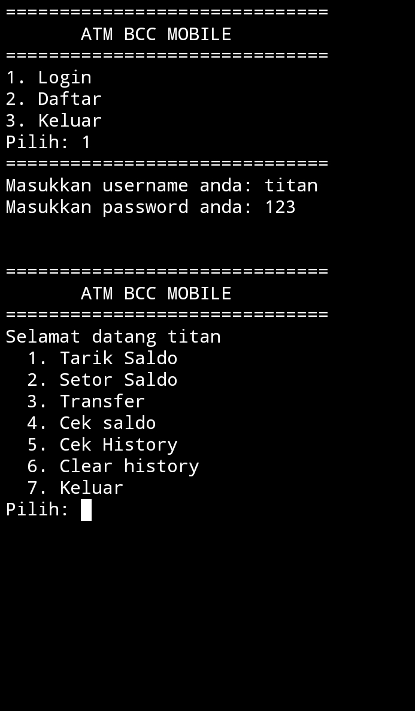

# 👋 Hi, I'm ZYU-AJA

🎓 Student from Indonesia
🤖 Interested in Artificial Intelligence, Robotics, and Software Engineering
🇯🇵 Dream: Study Engineering and AI in Japan
🐍 Currently learning Python and Object-Oriented Programming

## 🚀 Current Projects
### 🏦 ATM OOP Python
A banking simulation system built with Python and JSON storage.

Features:
- Login & Register
- Deposit
- Withdraw
- Transfer Balance
- Transaction History
- Account Blocking

Technologies:
- Python
- OOP
- JSON
## ⚙️ Installation

Clone this repository:

```bash
git clone https://github.com/ZYU-AJA/Banking-System-OOP.git
```

Move to the project directory:

```bash
cd Banking-System-OOP
```

## ▶️ How to Run

Run the application using Python:

```bash
python Atm.py
```

or

```bash
python3 Atm.py
```

## 📸 Screenshot
### Main Menu



## 🏗️ System Design

```text
User
  │
  ▼
ATM Menu
  │
  ├── Login
  ├── Register
  │
  ▼
Account
  │
  ├── Deposit
  ├── Withdraw
  ├── Transfer
  ├── check balance 
  └── History
  ├── check history
  │
  ▼
JSON Database
```
## 🎯 Learning Goals

- Advanced Python
- Data Structures & Algorithms
- Artificial Intelligence
- Machine Learning
- Computer Vision
- Robotics Engineering
- Japanese Language

## 📚 Future Projects

- Parking Management System
- AI Chatbot
- Face Recognition System
- Smart Home IoT
- Object Detection AI
- Humanoid Robotics

## 🛠️ Tech Stack
- Python
- Git
- GitHub
- JSON

## 📈 GitHub Journey

2026 ✅ Learn Python Basics
2026 ✅ Build ATM OOP Project
2027 🎯 Build AI Projects
2027 🎯 Join Programming Competitions
2028 🎯 Build Robotics Projects
2028-2029 🎯 Prepare for Engineering University

## 🌟 Motto
"Learn, Build, Improve, Repeat."
